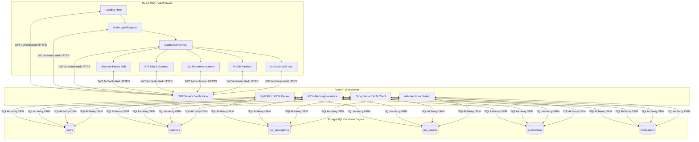

# AI Resume Screening & Job Recommendation Platform

An advanced, production-grade student placement accelerator platform designed to help students analyze resume compatibility against target jobs, grade circular ATS keyword checklists, generate tailored cover letters, map learning roadmaps, and trigger automated placement tracking pipelines.

---

## 🌟 Key Platform Capabilities

1. **AI Heuristic Resume Parser**: Upload PDF/DOCX resumes. The backend extracts text layout blocks, maps email/phone signatures, identifies tech skills, and synchronizes user profiles automatically.
2. **Circular ATS Compatibility Gauge**: Select seeded jobs or paste a target description. Our scoring engine compares skills and outputs a color-coded percentage breakdown (Skills, Keywords, Experience, Education) with suggestions for missing terms.
3. **Dynamic Job Matchmaker**: Lists job openings with calculated intersection matches comparing student skills to job specifications, complete with search inputs and category filters.
4. **AI Career Add-ons**:
   - **Interactive Learning Roadmap**: Inputs target jobs and plots progressive timeline milestones.
   - **Cover Letter Compiler**: Generates tailored copy-pasteable letters matching target companies.
   - **Interview Prep Coach**: Generates technical and behavioral Q&As tailored to the job description.
5. **n8n Automation Integrations**: Four active workflow loops managing report emails, cron alerts, ATS score monitors, and recruiter trackers.

---

## 📐 Architecture & System Flow



---

## 📁 Repository Folder Tree

```text
├── /backend                    # FastAPI Backend Application
│   ├── app/
│   │   ├── core/               # JWT security, Database sessions, Config loaders
│   │   ├── models/             # SQLAlchemy ORM Tables (Users, Resumes, Jobs)
│   │   ├── schemas/            # Pydantic JSON request/response structures
│   │   ├── routers/            # API Endpoint controllers (auth, jobs, ats, dashboard)
│   │   ├── services/           # PyPDF2 parser, LLM Groq integrations
│   │   └── main.py             # Server boot and database seeding hook
│   ├── requirements.txt        # Backend dependencies manifest
│   └── .env.example            # Environment configurations template
│
├── /frontend                   # React SPA Frontend Application
│   ├── src/
│   │   ├── components/         # Sidebar navigation, Navbars, Notification dropdowns
│   │   ├── pages/              # Landing page, Dashboards, ATS circle gauges, Job filters
│   │   ├── context/            # Auth and Theme states providers
│   │   ├── App.jsx             # Switchboard router and route guards
│   │   └── index.css           # Global custom scrollbars and glassmorphism styles
│   ├── package.json            # Frontend packages list
│   ├── vite.config.js          # Vite compilers configurations
│   └── tailwind.config.js      # Color tokens (indigo, cyan, success, warning)
│
├── /n8n_workflows              # n8n Automation Workflows (JSON formats)
│   ├── resume_upload_report.json
│   ├── daily_job_recommendation.json
│   ├── ats_monitoring.json
│   └── application_tracking.json
│
└── README.md                   # Complete Platform Guide
```

---

## 🛢️ Database Schema (PostgreSQL / SQLite)

The platform supports SQLAlchemy ORM mapping to SQLite (for rapid local debugging) and PostgreSQL (for production). The engine automatically constructs these schemas on startup:

```sql
-- 1. Users Table
CREATE TABLE users (
    id SERIAL PRIMARY KEY,
    email VARCHAR(255) UNIQUE NOT NULL,
    hashed_password VARCHAR(255) NOT NULL,
    full_name VARCHAR(255),
    summary TEXT,
    skills JSON,
    experience JSON,
    education JSON,
    profile_strength FLOAT DEFAULT 15.0,
    created_at TIMESTAMP DEFAULT CURRENT_TIMESTAMP
);

-- 2. Resumes Table
CREATE TABLE resumes (
    id SERIAL PRIMARY KEY,
    user_id INTEGER REFERENCES users(id) ON DELETE CASCADE,
    filename VARCHAR(255) NOT NULL,
    name VARCHAR(255),
    email VARCHAR(255),
    phone VARCHAR(255),
    skills JSON,
    experience JSON,
    education JSON,
    parsed_text TEXT,
    created_at TIMESTAMP DEFAULT CURRENT_TIMESTAMP
);

-- 3. Job Descriptions Table
CREATE TABLE job_descriptions (
    id SERIAL PRIMARY KEY,
    title VARCHAR(255) NOT NULL,
    company VARCHAR(255) NOT NULL,
    location VARCHAR(255) NOT NULL,
    type VARCHAR(50) DEFAULT 'Full-Time',
    workplace VARCHAR(50) DEFAULT 'Remote',
    description TEXT NOT NULL,
    required_skills JSON,
    required_keywords JSON,
    salary VARCHAR(100),
    created_at TIMESTAMP DEFAULT CURRENT_TIMESTAMP
);
```

---

## 🛠️ Step-by-Step Local Deployment Manual

### 1. Backend Server Installation (FastAPI)

1. Navigate to the backend directory:
   ```bash
   cd backend
   ```
2. Create and activate a Python virtual environment:
   ```bash
   python -m venv venv
   # On Windows:
   .\venv\Scripts\activate
   # On macOS/Linux:
   source venv/bin/activate
   ```
3. Install the required dependencies:
   ```bash
   pip install -r requirements.txt
   ```
4. Configure environment settings:
   - Copy `.env.example` to `.env`:
     ```bash
     cp .env.example .env
     ```
   - Provide your **Groq API Key** (optional, fallback offline mocks will activate if blank) inside `.env`:
     ```text
     GROQ_API_KEY=gsk_your_groq_api_token_here
     ```
5. Boot the FastAPI development server:
   ```bash
   uvicorn app.main:app --reload --port 8000
   ```
   *Note: On startup, the server automatically initializes database tables and seeds mock job listings (Vercel, Notion, Stripe, Linear) into the SQLite database.*

---

### 2. Frontend SPA Installation (React)

1. Navigate to the frontend directory:
   ```bash
   cd ../frontend
   ```
2. Install npm package dependencies:
   ```bash
   npm install
   ```
3. Start the Vite hot-reloading client development server:
   ```bash
   npm run dev
   ```
4. Open your browser and navigate to the visual landing page:
   ```text
   http://localhost:5173
   ```
   *Note: If the FastAPI backend is offline, the React client automatically detects this and loads in **High-Fidelity Sandbox Mode**, allowing mock profile updates, document scanning animations, and circular ATS grades.*

---

### 3. n8n Automation Workflows Setup

1. Boot or launch your local n8n instance:
   ```bash
   npx n8n
   ```
2. Open n8n dashboard (usually `http://localhost:5678`).
3. Click **Workflows** → **New Workflow**.
4. Click the top-right menu (three dots) and select **Import from File**.
5. Select any JSON template inside `/n8n_workflows/` to instantly mount:
   - **Resume Upload report**: Sends analysis emails on resume uploads.
   - **Daily job matches**: Emails recommended roles based on skills.
   - **ATS monitoring**: Triggers FastAPI calculations and logs progress.
   - **Recruiter tracker**: Schedules wait times and notifies follow-ups.

---

## 🚀 Production Deployment Guide

### Frontend Deployment (Vercel)
1. Install Vercel CLI or link your repository to the Vercel dashboard.
2. Configure **Build Settings**:
   - Build Command: `npm run build`
   - Output Directory: `dist`
3. Add environment configurations if custom endpoints are used.

### Backend Deployment (Render)
1. Click **New Web Service** on Render dashboard.
2. Link your repository, setting:
   - Environment: `Python`
   - Build Command: `pip install -r requirements.txt`
   - Start Command: `uvicorn app.main:app --host 0.0.0.0 --port $PORT`
3. Add environmental keys: `SECRET_KEY`, `GROQ_API_KEY`, and `DATABASE_URL` pointing to your hosted PostgreSQL database.
